# EcoTrack Pandi Waste Management System

**Validation of Predicted Waste Analysis and Characterization Study (WACS) of MENRO Pandi Using Linear Model and Time Series Analysis**

A web-based decision-support system that validates the Municipal Environment and Natural Resources Office (MENRO) of Pandi, Bulacan's manually computed solid waste generation forecasts against statistically modeled forecasts (Linear Regression + ARIMA), and visualizes past data, forecasts, and validation reports for stakeholders.

---

## Problem Statement

MENRO Pandi's waste generation forecasts are currently produced through manual, Excel-based calculations with **no statistical validation**, leaving forecast accuracy unverified. Forecast accuracy must be validated against a measurable benchmark of **R² ≥ 0.6**, the accepted threshold for reliable waste generation forecasting. To close this gap, statistical forecasting models (ARIMA and Linear Regression) must be developed and benchmarked against MENRO Pandi's manual estimates to confirm whether a data-driven approach can meet or exceed this threshold.

---

## Data

**Description:** Historical solid waste generation and population data collected from MENRO Pandi's Solid Waste Management (SWM) Plan and WACS records, broken down by barangay (village/district) and waste category:
- Biodegradable
- Recyclable
- Residual
- Special (household hazardous waste)
- Others

Population data covering all 21 barangays of Pandi, Bulacan was also collected to support the population-growth-to-waste-generation regression analysis.

**Range Covered:** 2020 – 2030
- **2020–2024:** Actual historical WACS and population data (base/training data)
- **2025–2030:** Forecasted projections generated by MENRO Pandi (manual/Excel-based) and validated against the study's statistical models (ARIMA, Linear Regression)
- **Rows:** 243
- **Columns:** 13

**Sources:**
- MENRO Pandi's official Solid Waste Management (SWM) Plan
- MENRO Pandi's Waste Analysis and Characterization Study (WACS) records
- Legal/regulatory basis for waste categorization: Republic Act 9003 (Ecological Solid Waste Management Act of 2000)
- National Solid Waste Management Commission (NSWMC) WACS implementation guidelines (2020)

---

## Methodology

### Data Cleaning & Preparation
- Removed duplicate and irrelevant entries
- Corrected/handled missing values and anomalies
- Removed outliers to prevent skewed model performance
- Standardized and sorted data to account for seasonal variation and long-term trends across barangays and waste categories
- Ensured consistency between waste generation datasets and population datasets prior to modeling

### Modeling Approach
Two statistical models were developed and validated:

1. **ARIMA (1,1,1) — Time Series Analysis**
   Used to forecast waste generation trends per category (biodegradable, recyclable, residual, special) by identifying seasonal variation and long-term temporal patterns.

2. **Linear Regression**
   Used to model the relationship between population growth and waste generation, forecasting population trends for all 21 barangays through 2030.

### Model Evaluation
Model accuracy was validated using three standard performance metrics, comparing model output against MENRO Pandi's actual/manual WACS data:
- **MAE** (Mean Absolute Error)
- **RMSE** (Root Mean Square Error)
- **R²** (Coefficient of Determination)

### Development Frameworks
- **CRISP-DM** (Cross-Industry Standard Process for Data Mining) — guided the analytics/modeling workflow: Business Understanding → Data Understanding → Data Preparation → Modeling → Evaluation → Deployment
- **Agile** — guided iterative development of the EcoTrack Pandi Waste web application
- **ISO/IEC 25010** — software quality standard used to evaluate the deployed system (functional suitability, performance efficiency, compatibility, usability, reliability, security, maintainability, portability)

### Tools & Tech Stack
| Layer | Technology |
|---|---|
| Statistical Modeling / Data Preprocessing | Python |
| Backend | PHP  |
| Database | MySQL  |
| Frontend | HTML5, CSS3, JavaScript |
| Data Visualization | Chart.js, Recharts |
| Query Language | SQL |

---

## Insights
1) Total Waste Volume by Barangay Over Time
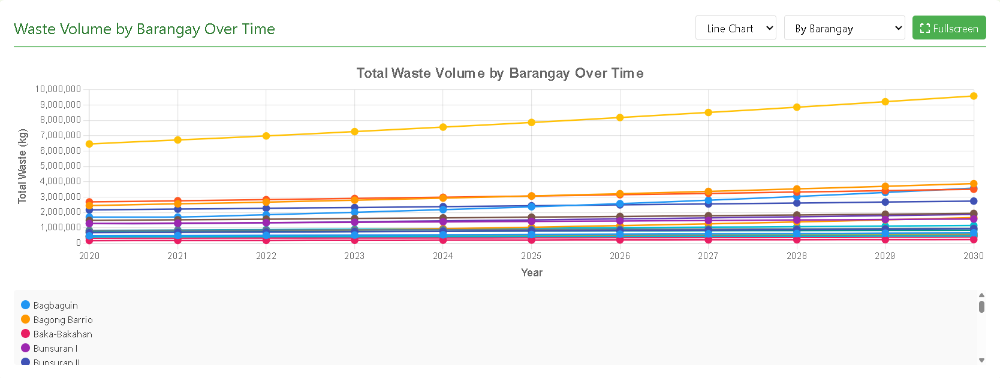
- Waste volume is steadily increasing across all barangays from 2020 to 2030. 
- A few barangays contribute significantly more waste than others.

2) Population Forecast
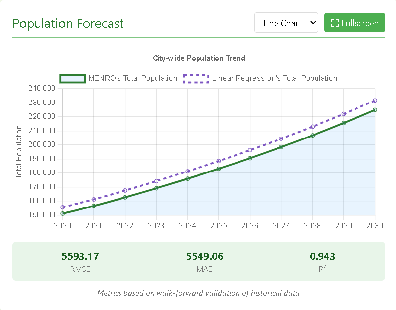
- The city's population is projected to grow steadily from 2020 to 2030. 
- The Linear Regression model provides reliable population forecasts with an R² value of 0.943

3) Waste Forecast
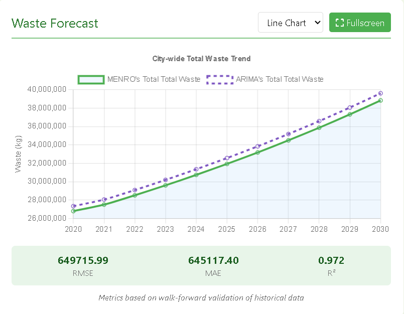
- The city's total waste generation is projected to increase steadily from 2020 to 2030.
- The ARIMA model produces accurate waste forecasts. With an R² value of 0.972.
  
4) Top 3 Barangays with Highest Recyclable Waste
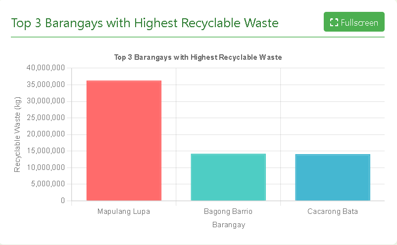
- Mapulang Lupa generates the highest amount of recyclable waste among all barangays. 
- Bagong Barrio and Cacarong Bata rank second and third in recyclable waste generation.

5) Waste Composition by Barangay
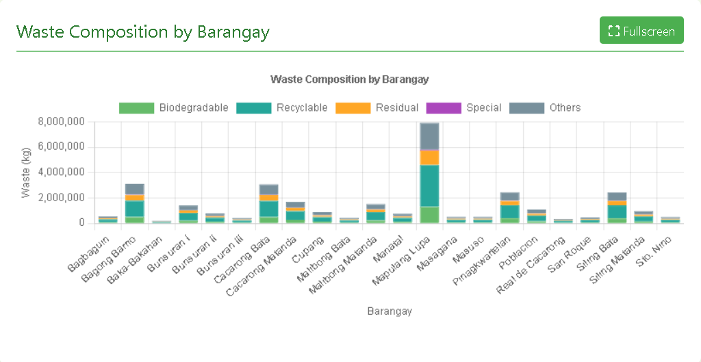
- Biodegradable and recyclable waste make up the largest portion of waste across most barangays.
- Mapulang Lupa records the highest overall waste volume and leads across multiple waste categories.

6) Waste Composition Overtime
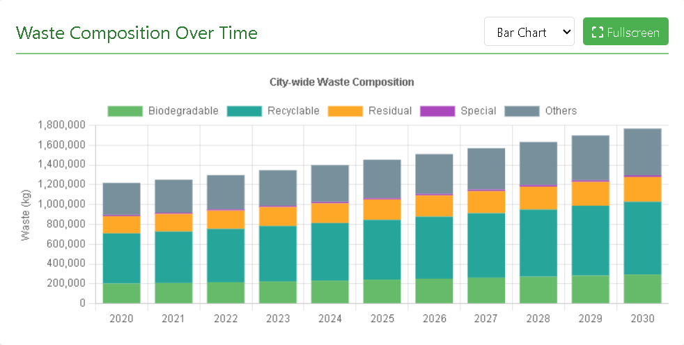
- The total volume of all waste types increases steadily from 2020 to 2030.
- Recyclable and biodegradable waste consistently make up the largest share of the city's waste composition.

7) Top 3 Barangays by Waste Generation
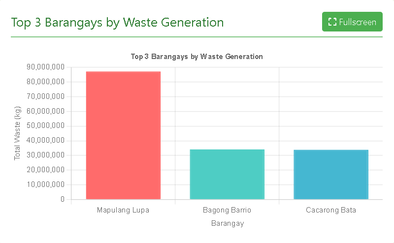
- Mapulang Lupa generates significantly more waste than the other top barangays, making it the largest contributor to total waste generation.
- Bagong Barrio and Cacarong Bata produce almost the same amount of waste, indicating similar waste generation levels.

8) Top Contributing Waste Types
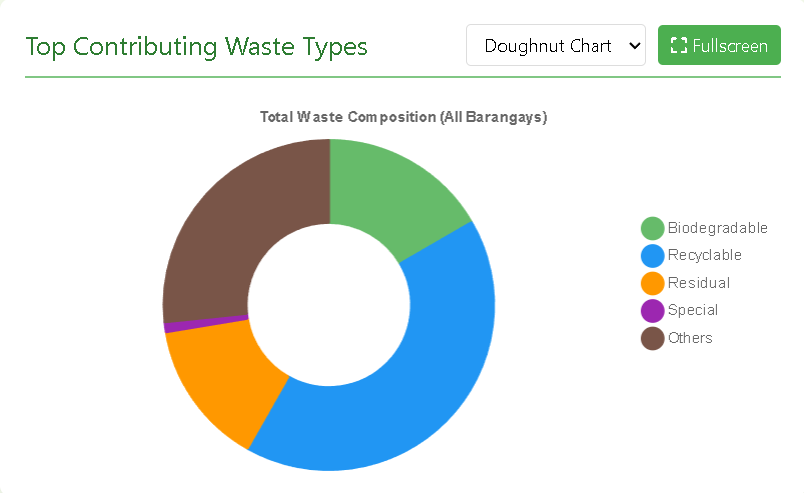
- Recyclable waste makes up the largest share of the total waste composition.
- Biodegradable and other waste types also contribute significantly, while special waste accounts for only a small portion of the total.

9) Net Waste by Barangay (2025)
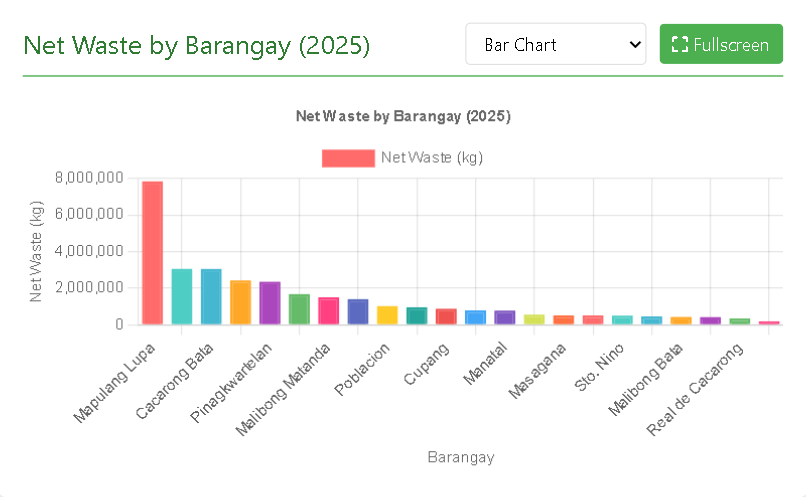
- Mapulang Lupa has the highest net waste in 2025, significantly exceeding all other barangays and making it the largest contributor.
- Most other barangays generate considerably lower and relatively similar net waste levels, indicating a more balanced distribution among them.

10) Population Forecast Validation
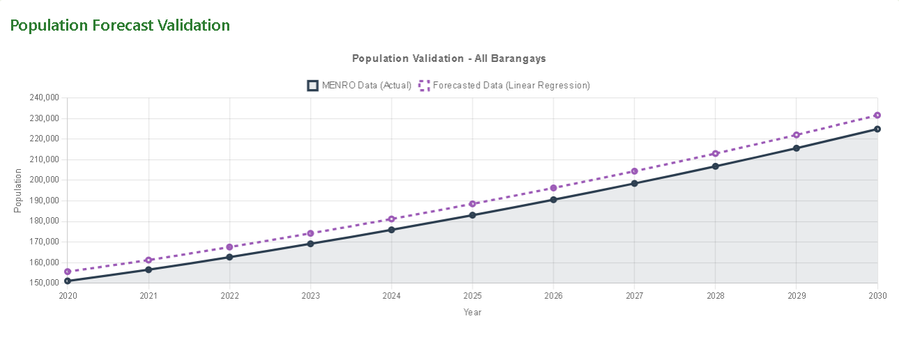
- The forecast closely follows the actual population trend, consistently remaining slightly higher while maintaining the same upward growth pattern from 2020 to 2030, indicating a good overall model fit.
- Both actual and forecasted populations show steady year-on-year growth, suggesting continued population increase across all barangays with no significant fluctuations or declines.

11) Waste Forecast Validation
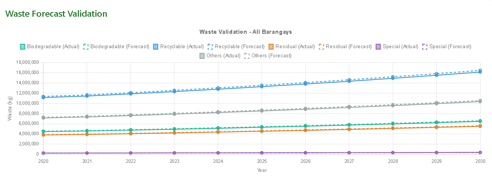
- The forecasted waste values closely align with the actual data across all waste categories, showing that the forecasting model accurately captures the increasing waste generation trend.
- Recyclable waste remains the largest waste category, while all waste types exhibit a steady upward trend, indicating growing waste generation that will require improved waste management strategies.

12) Summary of Accuracy Metrics
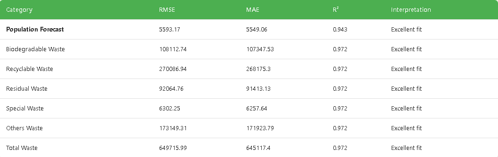
- All forecasting models achieved an excellent fit, with high R² values (0.943–0.972).
- The low RMSE and MAE values across all categories indicate minimal prediction errors.

## Recommendations
- Integration of Internet of Things (IoT) sensors for real-time waste tracking
- Collection of more granular historical data to identify seasonal trends
- Expansion of the system for adoption by other Local Government Units (LGUs)

---

## Authors
Alvarez, David · Bello, Jem Creydel · Dela Peña, Edrian · Gabriel, Justine Rey · San Jose, Irish L. · Sison, Len Nathaniel

**Adviser:** Dr. Jayson M. Victoriano

**Institution:** College of Information and Communications Technology, Bulacan State University

**Date:** November 2025
